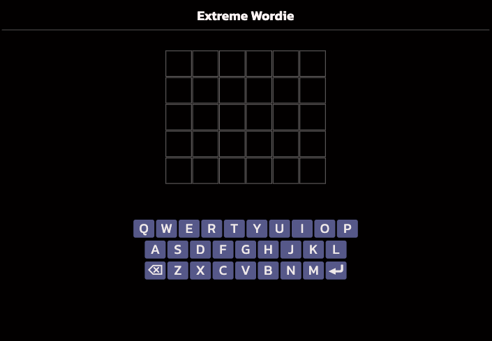
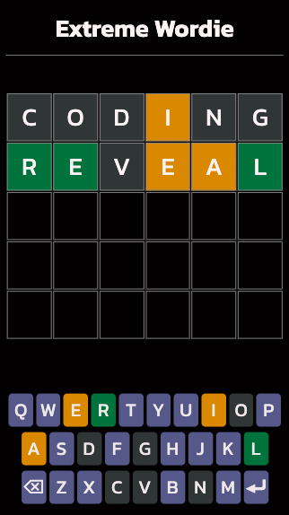
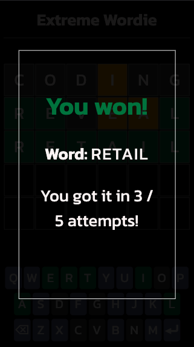

# Extreme Wordie

Extreme Wordie is a full-stack browser based game based on Wordle. 

I've been playing Wordle on a daily basis for more than a year, and wanted to create my own version...with a slight twist!

Rather than having 6 attempts to guess a 5 letter word, with Extreme Wordle you have 5 shots at figuring out a 6 letter word. Just like Wordle, users get a different word to guess every day of the week. 

**Live site:** https://extreme-wordie.vercel.app/

## Tech Stack
- **Client:** React.js, CSS Modules, Vercel
- **Server:** Node.js, Express.js, PostgreSQL, Render, Postman

## V1 Features
In my first iteration of Extreme Wordie, users can:
- Attempt to guess "today's word", which is a different word each day
- See feedback on the game's board and keyboard based on if a letter in their attempt is:
  - "correct" (letter is in the word and in the right position)
  - "almost" correct (letter is in the word but in the wrong position)
  - "incorrect" (letter is not in the word)
- See a prompt at the end of the game if they were successful / unsuccessful

## V1 Screenshots

